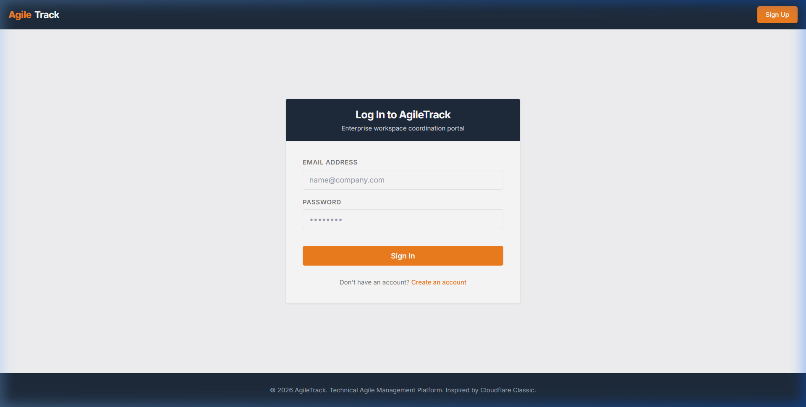
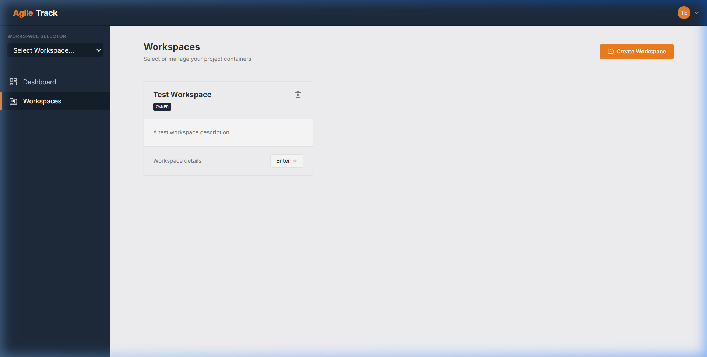
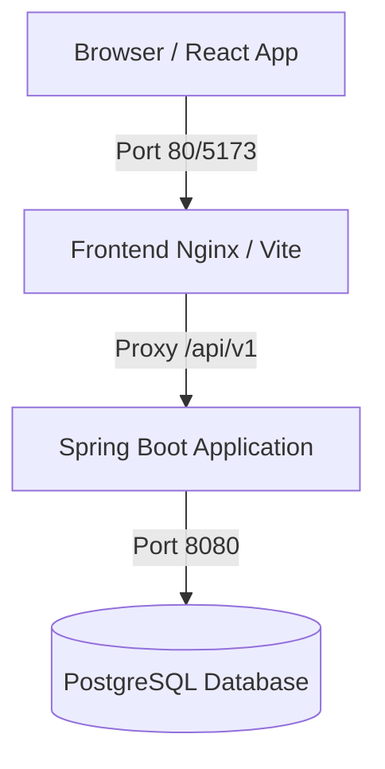
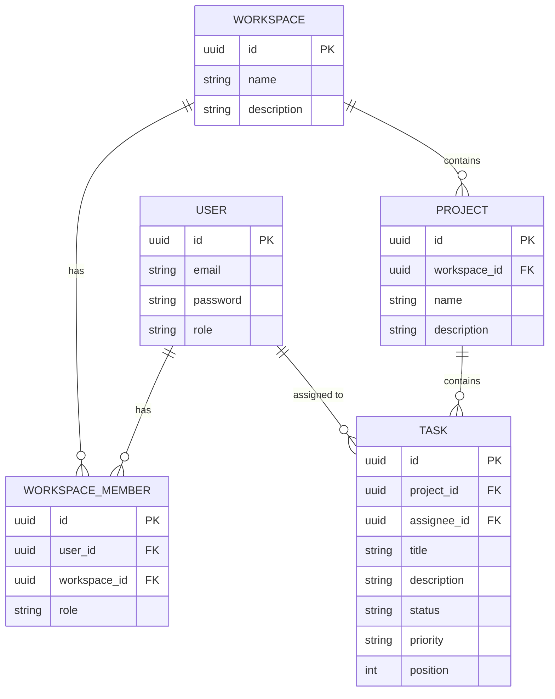

# AgileTrack

[](https://github.com/0-YuvrajSingh/AgileTrack/actions)

AgileTrack is a high-performance Agile Management Portal that simplifies project tracking, task boards, and team workflows. It features a modern, responsive React frontend and a robust Spring Boot backend powered by PostgreSQL.

---

## Preview

### Login Page


### Dashboard & Task Board


---

## Key Features
- **Workspaces & Projects**: Organize your work into distinct workspaces and projects.
- **Interactive Task Board**: Drag-and-drop task status updates with custom task ordering.
- **JWT-Based Authentication**: Secure sign-up, sign-in, and session management.
- **Dockerized Environment**: Quick multi-container setup for local testing and deployment.
- **Database Migrations**: Automatic and versioned schema management using Flyway.

---

## Architecture

The project is structured as a decoupled monorepo containing two main services and a database:



### Database Schema



### Tech Stack
- **Frontend**: React (v19), TypeScript, TailwindCSS, Lucide React (Icons), React Router, Axios.
- **Backend**: Java 21, Spring Boot (v3.3.5), Spring Security (JWT), Spring Data JPA, Hibernate, Flyway.
- **Database**: PostgreSQL (v15+).
- **Hosting/Containers**: Docker & Docker Compose.

---

## Getting Started

### Live Demo
> Deployed at your-deployment-url — register an account or use the demo credentials below.

| Role | Email | Password |
|------|-------|----------|
| Demo User | `demo@agiletrack.com` | `Demo@12345` |

### Quick Start with Docker (Recommended)

To run the entire stack (Frontend, Backend, and Database) with a single command, ensure you have Docker installed and run:

```bash
docker-compose up --build
```

- **Frontend Application**: accessible at [http://localhost](http://localhost)
- **Backend REST API**: accessible at [http://localhost:8080](http://localhost:8080)
- **Database Port**: bound to `localhost:5432`

To stop the containers and keep database volumes:
```bash
docker-compose down
```

---

### Local Development Setup

If you prefer to run the services individually without Docker, configure your local environment as follows:

#### 1. Setup PostgreSQL Database
- Create a PostgreSQL database named `agiletrack_db` on port `5432`.
- Update credentials in `backend/src/main/resources/application.yaml` or set environment variables:
  ```bash
  POSTGRES_USER=postgres
  POSTGRES_PASSWORD=postgres
  ```

#### 2. Start the Backend
1. Navigate to the `backend/` directory.
2. Build the application and run migrations:
   ```bash
   ./mvnw spring-boot:run
   ```
   The backend will start on [http://localhost:8080](http://localhost:8080).

#### 3. Start the Frontend
1. Navigate to the `frontend/` directory.
2. Install dependencies:
   ```bash
   npm install
   ```
3. Run the development server:
   ```bash
   npm run dev
   ```
   The frontend will start on [http://localhost:5173](http://localhost:5173).

---

## API Reference

### Authentication
- `POST /api/v1/auth/register` - Register a new user account.
- `POST /api/v1/auth/login` - Authenticate a user and receive a JWT token.

### Workspaces
- `GET /api/v1/workspaces` - Retrieve all workspaces of the current user.
- `POST /api/v1/workspaces` - Create a new workspace.
- `DELETE /api/v1/workspaces/{id}` - Delete a workspace.

### Projects
- `GET /api/v1/workspaces/{workspaceId}/projects` - Retrieve all projects in a workspace.
- `POST /api/v1/workspaces/{workspaceId}/projects` - Create a project in a workspace.
- `DELETE /api/v1/workspaces/{workspaceId}/projects/{projectId}` - Delete a project.

### Tasks
- `GET /api/v1/workspaces/{workspaceId}/projects/{projectId}/tasks` - Get all tasks in a project.
- `POST /api/v1/workspaces/{workspaceId}/projects/{projectId}/tasks` - Create a new task.
- `PUT /api/v1/workspaces/{workspaceId}/projects/{projectId}/tasks/{taskId}` - Update task details.
- `DELETE /api/v1/workspaces/{workspaceId}/projects/{projectId}/tasks/{taskId}` - Delete a task.
- `PATCH /api/v1/workspaces/{workspaceId}/projects/{projectId}/tasks/{taskId}/status` - Update task status (for drag-and-drop).
- `PATCH /api/v1/workspaces/{workspaceId}/projects/{projectId}/tasks/{taskId}/position` - Reorder task positions.

---

## Swagger / OpenAPI Docs
When the backend service is running, you can explore and test the API interactively at:
[http://localhost:8080/swagger-ui/index.html](http://localhost:8080/swagger-ui/index.html)

---

## Deployment

### Environment Variables

Copy `.env.example` to `.env` and fill in:

| Variable | Description | Example |
|----------|-------------|---------|
| `JWT_SECRET` | Random 256-bit key for signing JWTs | `openssl rand -base64 32` |
| `JWT_EXPIRATION` | Access token TTL in ms (default 24h) | `86400000` |
| `JWT_REFRESH_EXPIRATION` | Refresh token TTL in ms (default 7d) | `604800000` |
| `FRONTEND_ORIGIN` | Allowed CORS origin for the API | `https://your-frontend.vercel.app` |
| `POSTGRES_*` | Database credentials | See `.env.example` |

### Deploy to Vercel + Render (Recommended for Students)

**Frontend (Vercel):**
1. Push to GitHub, import in [vercel.com](https://vercel.com)
2. Set env var `VITE_API_BASE_URL` to your backend URL (e.g. `https://your-app.onrender.com/api/v1`)

**Backend (Render):**
1. Create a free Web Service on [render.com](https://render.com)
2. Build command: `cd backend && ./mvnw clean package -DskipTests`
3. Start command: `java -jar backend/target/*.jar`
4. Add env vars: `DATABASE_URL`, `JWT_SECRET`, `FRONTEND_ORIGIN`, etc.

**Database (Neon or Supabase free tier):**
1. Create a PostgreSQL database
2. Use the connection string as `DATABASE_URL` (format: `jdbc:postgresql://host:5432/dbname?sslmode=require`)
