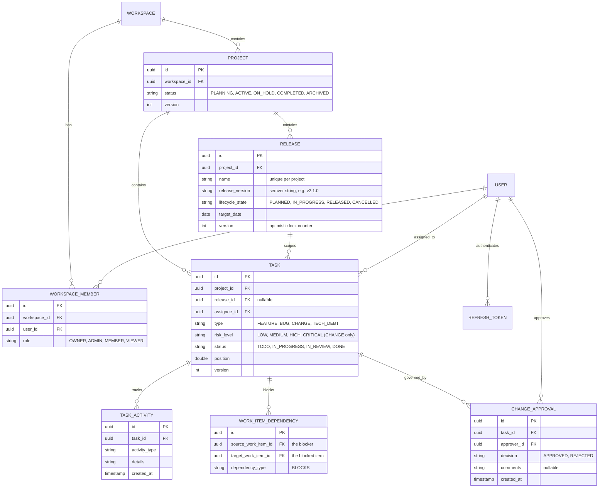

# AgileTrack

AgileTrack is a multi-tenant **engineering delivery and change management platform** built with React (TypeScript) and Spring Boot. Teams plan work items, group them into releases, record what blocks what, and ask one question the tool answers deterministically:

> **Can this release ship — and if not, exactly why not?**

The answer is derived from committed database state on every request. There is no readiness flag to set, no endpoint that writes one, and no way for the verdict to disagree with the work items it summarises.

Underneath, it is a strict multi-tenant system: workspace-scoped authorization on every mutation, JPA optimistic locking with a real `409 Conflict` contract, Flyway-managed schema, and an append-only activity trail written in the same transaction as the change it describes.

---

## The delivery model

```
Workspace → Project → Work item ──┬── belongs to a Release
                                  └── BLOCKS / is blocked by other work items
                                           ↓
                                  Release readiness (derived)
```

**Work items** carry a type — `FEATURE`, `BUG`, `CHANGE`, `TECH_DEBT` — alongside status, priority, assignee and board position. `CHANGE` work items specifically carry a `risk_level` (`LOW`, `MEDIUM`, `HIGH`, `CRITICAL`).

**Change Governance** enforces approval policies on `CHANGE` work items. Under the fixed policy, `LOW` and `MEDIUM` changes do not require approval. `HIGH` and `CRITICAL` changes require an active `APPROVED` decision recorded by an authorized user (`MEMBER`, `ADMIN`, `OWNER`) before a release containing them is ready to ship.

**Releases** are a versioned delivery scope inside a project, moving through `PLANNED → IN_PROGRESS → RELEASED`, with `CANCELLED` reachable from either non-terminal state. Scope freezes when a release leaves `PLANNED`; its own fields stay editable until it reaches a terminal state. Both facts are returned as derived `scopeLocked` / `editable` fields so the UI never re-implements the rule.

**Dependencies** are directional `BLOCKS` edges between work items in the same project. The graph is kept acyclic, and an item with an unresolved blocker cannot be moved to `DONE` — by the server, whatever the UI allows.

**Readiness** is a computed verdict over all of the above:

```jsonc
GET /api/v1/workspaces/{ws}/projects/{p}/releases/{r}/readiness

{
  "releaseName": "Q3 UI Refresh",
  "lifecycleState": "PLANNED",
  "status": "NOT_READY",
  "totalWorkItems": 3,
  "completedWorkItems": 0,
  "reasons": [
    { "code": "INCOMPLETE_WORK", "workItemTitle": "Build reusable component library",
      "detail": "\"Build reusable component library\" is IN_PROGRESS, not DONE" },
    { "code": "INCOMPLETE_WORK", "workItemTitle": "Drag-and-drop task board",
      "detail": "\"Drag-and-drop task board\" is IN_REVIEW, not DONE" },
    { "code": "INCOMPLETE_WORK", "workItemTitle": "Implement authentication pages",
      "detail": "\"Implement authentication pages\" is IN_PROGRESS, not DONE" },
    { "code": "BLOCKED_WORK", "workItemTitle": "Drag-and-drop task board",
      "detail": "\"Drag-and-drop task board\" is blocked by \"Build reusable component library\" (IN_PROGRESS)" },
    { "code": "APPROVAL_REQUIRED", "workItemTitle": "Database Schema Migration",
      "detail": "\"Database Schema Migration\" is HIGH risk and requires approval before release" }
  ]
}
```

`NOT_READY` always carries at least one reason — a verdict nobody can act on is not worth returning. Reasons are sorted by code, then title, then id, so identical database state always produces byte-identical output rather than whatever order Postgres happened to return rows in.

**Gates currently evaluated:** `RELEASE_CANCELLED`, `EMPTY_RELEASE`, `INCOMPLETE_WORK`, `BLOCKED_WORK`, and `APPROVAL_REQUIRED`. All 5 gates are deterministic and evaluated on-demand from committed database state.

---

## Try it in five minutes

`docker-compose up --build`, then sign in as `demo@agiletrack.com` / `Demo@12345`.

The seed data is shaped so every readiness verdict is already visible:

| Where | Release | Verdict |
|---|---|---|
| Frontend Redesign | **Design System Baseline** (`IN_PROGRESS`) | `READY` — every gate passes, scope locked |
| Frontend Redesign | **Q3 UI Refresh** (`PLANNED`) | `NOT_READY` — 3 × `INCOMPLETE_WORK`, 1 × `BLOCKED_WORK` |
| Frontend Redesign | **Native Mobile Shell** (`CANCELLED`) | `NOT_READY` — `RELEASE_CANCELLED` + `INCOMPLETE_WORK` |
| API v2 | **API v2.0 Cutover** (`PLANNED`) | `NOT_READY` — a four-item dependency chain |
| API v2 | **API v2.0 Cutover** (`PLANNED`) | `NOT_READY` — 4 × `APPROVAL_REQUIRED`, 4-item dependency chain |
| API v2 | **API v2.1 Planning** (`PLANNED`) | `NOT_READY` — `EMPTY_RELEASE` |

Five things worth clicking, in order:
Seven things worth clicking, in order:

1. **Open Q3 UI Refresh.** Read the reasons. Then open *Design System Baseline* and watch the same panel say `READY`.
2. **Try to finish blocked work.** *Drag-and-drop task board* sits in In Review. Drag it to Done. Rejected — `"Drag-and-drop task board" cannot be completed while blocked by "Build reusable component library"`. Nothing in the UI stopped you; the service did.
3. **Resolve the blocker.** Move *Build reusable component library* to Done, then reload the release. `BLOCKED_WORK` is gone and the count moved — nothing was recomputed by hand, because nothing was stored.
4. **Try to create a cycle.** In API v2, open *Design database schema v2* and add *Deprecate v1 task endpoints* as a blocker. Rejected, with the path that would have closed the loop: the chain already runs schema → auth migration → deprecate v1.
5. **Force a conflict.** Open one work item in two tabs, change it in both. The second save returns `409` and the UI rolls back rather than overwriting.
1. **Land on the Engineering Release Dashboard (`/dashboard`).** Switch between releases via the active release dropdown or the portfolio table. Notice how *Design System Baseline* immediately shows `READY TO SHIP` with 100% completion, while *Q3 UI Refresh* and *API v2.0 Cutover* show `NOT READY` with exact blocker counts, pending approvals, work item breakdown, and machine-readable reasons.
2. **Open Q3 UI Refresh in the Release Cockpit.** Read the explicit gate reasons. Notice scope lock controls and progress tracking.
3. **Try to finish blocked work.** *Drag-and-drop task board* sits in In Review. Drag it to Done. Rejected — `"Drag-and-drop task board" cannot be completed while blocked by "Build reusable component library"`. Nothing in the UI stopped you; the service did.
4. **Resolve the blocker.** Move *Build reusable component library* to Done, then reload the release. `BLOCKED_WORK` is gone and the count moved — nothing was recomputed by hand, because nothing was stored.
5. **Govern high-risk changes.** In API v2, open the Change Governance modal (shield icon) on *Design database schema v2* (`HIGH` risk). Review the policy requirement, approve the change with comments, and see the activity history record `APPROVAL_GRANTED`.
6. **Try to create a cycle.** In API v2, open *Design database schema v2* and add *Deprecate v1 task endpoints* as a blocker. Rejected, with the path that would have closed the loop: the chain already runs schema → auth migration → deprecate v1.
7. **Force a conflict.** Open one work item in two tabs, change it in both. The second save returns `409` and the UI rolls back rather than overwriting.

Seeded rows are written as fixtures rather than through the service layer, so they carry no activity history. History fills in as you act — every change you make above is recorded.

---

## Architecture

```mermaid
flowchart TD
    Client[React SPA - Vite / Axios] -->|JWT| Filter[Spring Security Filter Chain]
    Filter --> Controllers[REST Controllers - HTTP + DTO only]
    Controllers --> Services[Service layer - authorization, business rules, transactions]
    Services --> Derived[ReadinessService - derived verdict]
    Services --> Graph[DependencyCycleDetector - bounded BFS]
    Services --> Approvals[ApprovalService - Change Risk Policy]
    Services --> Audit[TaskActivityRecorder - same transaction]
    Services -->|@Version| Repos[Spring Data JPA]
    Derived --> Repos
    Graph --> Repos
    Approvals --> Repos
    Audit --> Repos
    Repos --> DB[(PostgreSQL - Flyway V1-V15)]
```

A modular monolith, deliberately. The domains are highly relational and every mutation spans the tenant chain, so splitting them would trade transactional integrity for distributed-systems overhead at a scale that does not need it.

**Layer responsibilities**

- **Controller** — HTTP mapping, DTO binding, status codes. No business logic.
- **Service** — authorization, business rules, transaction boundaries. Every rule below lives here.
- **Repository** — data access only.
- **React components** — UI coordination. **Hooks** own server state. **Services** own HTTP. No business rule is re-implemented in the browser; the readiness panel renders the server's verdict rather than deriving its own.

---

## Domain model


```mermaid
erDiagram
    WORKSPACE ||--o{ WORKSPACE_MEMBER : has
    USER ||--o{ WORKSPACE_MEMBER : acts_as
    WORKSPACE ||--o{ PROJECT : contains
    PROJECT ||--o{ TASK : contains
    PROJECT ||--o{ RELEASE : contains
    RELEASE ||--o{ TASK : scopes
    USER ||--o{ TASK : assigned_to
    TASK ||--o{ TASK_ACTIVITY : tracks
    TASK ||--o{ WORK_ITEM_DEPENDENCY : blocks
    TASK ||--o{ CHANGE_APPROVAL : governed_by
    USER ||--o{ REFRESH_TOKEN : authenticates
    USER ||--o{ CHANGE_APPROVAL : approves

    WORKSPACE_MEMBER {
        uuid id PK
        uuid workspace_id FK
        uuid user_id FK
        string role "OWNER, ADMIN, MEMBER, VIEWER"
    }
    PROJECT {
        uuid id PK
        uuid workspace_id FK
        string status "PLANNING, ACTIVE, ON_HOLD, COMPLETED, ARCHIVED"
        int version
    }
    RELEASE {
        uuid id PK
        uuid project_id FK
        string name "unique per project"
        string release_version "semver string, e.g. v2.1.0"
        string lifecycle_state "PLANNED, IN_PROGRESS, RELEASED, CANCELLED"
        date target_date
        int version "optimistic lock counter"
    }
    TASK {
        uuid id PK
        uuid project_id FK
        uuid release_id FK "nullable"
        uuid assignee_id FK
        string type "FEATURE, BUG, CHANGE, TECH_DEBT"
        string risk_level "LOW, MEDIUM, HIGH, CRITICAL (CHANGE only)"
        string status "TODO, IN_PROGRESS, IN_REVIEW, DONE"
        double position
        int version
    }
    CHANGE_APPROVAL {
        uuid id PK
        uuid task_id FK
        uuid approver_id FK
        string decision "APPROVED, REJECTED"
        string comments "nullable"
        timestamp created_at
    }
    WORK_ITEM_DEPENDENCY {
        uuid id PK
        uuid source_work_item_id FK "the blocker"
        uuid target_work_item_id FK "the blocked item"
        string dependency_type "BLOCKS"
    }
    TASK_ACTIVITY {
        uuid id PK
        uuid task_id FK
        string activity_type
        string details
        timestamp created_at
    }
```

`release_version` is the semantic string a human reads (`v2.1.0`); `version` is the JPA locking counter. They are separate columns for that reason.

The `Release` entity is new; `Task` was extended rather than renamed. Work items share one table because every kind of engineering work carries the same fields — a `CHANGE` differs from a `FEATURE` by its `type`, not by its lifecycle. Releases and dependencies are separate tables because each has its own lifecycle, its own authorization rule and its own audit trail.

---

## Rules the server enforces

Each of these is covered by a test that fails if the rule is broken. None of them depend on the UI hiding a button.

| Rule | Enforced by | Failure mode |
|---|---|---|
| Mutations only within an authorized workspace → project → resource chain | Every service method, before any write | `404` |
| A UUID is an identifier, never an authorization grant | Parent-scoped lookups (`findByIdAndProjectId`) | `404` |
| A work item cannot reach `DONE` with an unresolved `BLOCKS` dependency | `BlockedCompletionGuard` | `400`, naming the blockers |
| A dependency cycle cannot be created | `DependencyCycleDetector`, inside the write transaction | `400`, naming the path |
| A work item cannot join a release in another project | `ReleaseService`, project-scoped lookup | `404` |
| A release cannot be mutated once its lifecycle forbids it | `ReleaseLifecycleState` guards | `400` |
| Non-CHANGE work items cannot carry a risk level | `TaskService` + DB check constraint | `400` |
| Approvals can only be recorded for CHANGE work items | `ApprovalService` | `400` |
| VIEWER cannot submit an approval decision | `ApprovalService` RBAC guard | `403` |
| Approver authority is derived from authenticated session context | `CurrentUserService` | Client cannot spoof approver |
| Releases containing unapproved or rejected HIGH/CRITICAL changes cannot be released | `ReadinessService.approvalGate` | `APPROVAL_REQUIRED` |
| Readiness is derived, never user-editable | No write endpoint exists | — |
| Every `NOT_READY` carries explicit reasons | `ReadinessService` | — |
| Stale writes fail rather than overwrite | `@Version` + `OptimisticLockGuard` | `409` |
| Activity is written in the mutation's own transaction | `TaskActivityRecorder` | rolls back with the mutation |
| Archived projects stay immutable | `ProjectService.requireMutable` | `400` |

RBAC sits on top: `OWNER` alone renames or deletes the workspace, `OWNER` and `ADMIN` manage members, `MEMBER` creates and edits work, `VIEWER` is refused every mutation — all checked in the service layer, so hiding or unhiding a button in React changes nothing.

Cross-tenant reads return `404`, not `403`. A `403` would confirm the resource exists.

---

## Engineering decisions

### Readiness is computed, not stored

A stored readiness flag has to be invalidated by three tables that change independently — work items, dependencies and releases. Every write path would have to remember to recompute it, and the day one path forgets, the platform's headline answer is silently wrong. Deriving it on read makes that class of bug unrepresentable. Nothing is cached, because nothing has been measured that says it needs to be: the evaluation is a bounded number of queries regardless of release size, and the blocked-work gate batches into one.

### Cycle detection rejects on uncertainty

Before an edge is written, a breadth-first search asks whether a path already runs from the proposed target back to the source. It expands a whole frontier per query rather than a node at a time, and the query returns both endpoints of each edge as a projection, so the path used in the rejection message is reconstructed without a second round of lookups.

The search is bounded — depth 100, 10,000 visited nodes — and **hitting either bound throws rather than returning "no cycle found."** An unbounded traversal is a denial-of-service surface; a bounded one that fails open silently corrupts the graph. The bounds are tested against synthetic graphs rather than by inserting a million rows.

The check runs inside the same transaction as the insert, so a concurrent writer cannot slip a conflicting edge between the check and the write.

### Optimistic locking is a contract, not just an annotation

`@Version` on the entity only protects concurrent server transactions. To protect a user who loaded a screen thirty seconds ago, the version has to travel: responses expose it, `PUT` requires it, and the service compares it before touching the row.

`PUT` requires a version because a full replace must be based on a real read. Status transitions honour a version when sent and skip the check when absent, which keeps drag-and-drop workable. Both halves are tested, so the looseness is deliberate and pinned rather than accidental.

The client never retries automatically. A retry would overwrite the other person's explicit intent without asking; a `409` and a reload asks.

### Activity history cannot drift from the change

Every mutation records its own history through `TaskActivityRecorder`, inside the same `@Transactional` method as the write. If the write rolls back — a `409`, a validation failure, a cycle rejection — the history entry rolls back with it. There is no out-of-band writer and no listener, so a "task moved" record can never survive a move the database refused. Dependency edges are audited from **both** ends: each item's history explains what it is waiting on, and what is waiting on it.

### Blocked state is a query, not a field

Whether an item is blocked comes from a separate `/blocked-work-items` endpoint that answers for the whole project in one query, rather than a field on each work item that would cost a lookup per card on every board load.

### Search: `ILIKE` kept, `pg_trgm` rejected — on evidence

`EXPLAIN (ANALYZE, BUFFERS)` over a million generated tasks showed that because every query is anchored by `project_id`, even 10,000 tasks in a single project resolve in roughly 20 ms. A GIN trigram index would penalise every insert and update on a write-heavy board to improve a read latency nobody is waiting on. Deferred on measurement, not on taste.

---

## API surface

All resource routes are nested under the tenant chain — the path *is* the authorization scope.

```
POST   /api/v1/auth/register | login | refresh | logout

       /api/v1/workspaces                                      CRUD + /{id}/members
       /api/v1/workspaces/{ws}/projects                        CRUD + /{id}/status

       /api/v1/workspaces/{ws}/projects/{p}/tasks              CRUD
                                          .../{t}/status       PATCH   (blocked-completion guard)
                                          .../{t}/position     PATCH
                                          .../{t}/assignee     PUT
                                          .../{t}/activities   GET
                                          .../{t}/dependencies GET, POST, DELETE /{depId}
                                          .../{t}/approval     GET, POST (Change governance)
       /api/v1/workspaces/{ws}/projects/{p}/blocked-work-items GET

       /api/v1/workspaces/{ws}/projects/{p}/releases           GET, POST
                                       .../{r}                 GET, PUT, DELETE
                                       .../{r}/lifecycle       PATCH
                                       .../{r}/work-items      GET
                                       .../{r}/work-items/{t}  PUT, DELETE
                                       .../{r}/readiness       GET     ← no write verb, by design
```

`GET /tasks` accepts `search` and `type` query parameters, and is paginated.

---

## Testing

**284 tests: 208 backend, 76 frontend.** Backend integration tests run against real PostgreSQL via Testcontainers — H2 would not exercise the Flyway migrations, the check constraints or the dialect behaviour that production actually runs.

Coverage is organised around the rules rather than the classes:

- **Tenant isolation** — every new endpoint is probed with a valid UUID from another tenant, and must answer `404`.
- **Dependencies** — direct, transitive and self cycles rejected; both traversal bounds; blocked completion refused at the service layer even when the request is otherwise valid.
- **Change governance** — risk level rules, approval RBAC, approver context derivation, concurrency protection on approvals, activity audit, and nested `APPROVAL_REQUIRED` readiness gating.
- **Readiness** — each gate in isolation, gates in combination, and reason ordering asserted so the output is reproducible.
- **Concurrency** — genuine stale writes against tasks, projects and releases, asserted as `409` end to end rather than mocked.
- **Frontend** — services, hooks, modals, the Engineering Release Dashboard, and panels that render server verdicts, including that the readiness panel preserves server ordering instead of re-sorting.

```bash
cd backend  && ./mvnw test          # 208
cd frontend && npm test             # 76
```

A `PerformanceBenchmarkTest` exists but is tagged `benchmark` and excluded from the default run: it inserts about 1.1 million rows, asserts nothing and is a measurement harness rather than a test. Run it deliberately with `./mvnw test -Dgroups=benchmark`.

---

## Security

- **Passwords** — BCrypt: salted and deliberately slow, because human-chosen passwords are low-entropy.
- **Refresh tokens** — stored as SHA-256 hashes and rotated on use. SHA-256 rather than BCrypt because the tokens are high-entropy random values and the server needs an indexed lookup; BCrypt's per-call salt makes `WHERE hash = ?` impossible.
- **Access tokens** — validated statelessly on every request. The `prod` profile defaults to a 15-minute lifetime; the default profile defaults to 24 hours. `docker-compose.yml` uses the 15-minute default; **set `JWT_EXPIRATION` explicitly for any real deployment** rather than relying on defaults.
- **Authorization** — enforced in the service layer against the parent chain, never by the presence of a UUID and never by the UI.
- **SQL injection** — parameterized throughout via Spring Data JPA.
- **CORS** — production reads a single permitted origin from `FRONTEND_ORIGIN`; no hardcoded localhost fallbacks in the prod profile.

**Known exposure, stated plainly:** tokens are held in browser storage. **Browser storage is not XSS-safe.** Any script that executes in the page can read them, and nothing in this codebase changes that. Hashing refresh tokens limits the damage of a *database* compromise; it does nothing for a *client* compromise. Moving to `HttpOnly; Secure` cookies with CSRF protection is a real hardening path and is **not** implemented — nothing here should be read as claiming cookie-level protection.

---

## What is not built

Stated explicitly so nothing above is read as more than it is.

- **Arbitrary workflow engines & approval matrices.** Approvals use a clear, deterministic fixed policy (LOW/MEDIUM bypass; HIGH/CRITICAL require approval). Configurable dynamic workflow rules and multi-stage sign-off matrices are intentionally not built.
- **Incident semantics.** No incident type, severity or MTTR tracking.
- **Release editing in the UI.** The API supports renaming a release and changing its target date; the UI currently exposes create, lifecycle transitions and scope only.
- **Dependency types beyond `BLOCKS`.** `RELATES_TO` and friends would be edges that do not gate anything, and nothing currently needs them.
- **Real-time updates, background jobs, caching, search infrastructure.** No WebSockets, no Redis, no message broker, no Elasticsearch. Each would be added against a measurement, not in advance of one.
- **External notifications.** No email, Slack, or webhook dispatching on approval events.
- **Seed data guarding.** `DataSeeder` runs when `agiletrack.seed-demo-data` is `true` (the default, so the Docker demo works out of the box) and skips when the database already has users. Set `AGILETRACK_SEED_DEMO_DATA=false` for any real production deployment.

---

## Running locally

**Docker (recommended)** — this is the path the demo above assumes.

```bash
docker-compose up --build
```

- App: `http://localhost:3000`
- API: `http://localhost:3000/api/v1`
- Sign in: `demo@agiletrack.com` / `Demo@12345`

**Backend and frontend separately**

```bash
cd backend  && ./mvnw spring-boot:run     # :8080, needs PostgreSQL on :5432
cd frontend && npm install && npm run dev # :5173
```

Running the backend test suite requires a working Docker daemon for Testcontainers.

### Production environment variables

```env
# backend
DATABASE_URL=jdbc:postgresql://<host>:5432/<db>
DATABASE_USERNAME=...
DATABASE_PASSWORD=...
JWT_SECRET=...                      # 256-bit key; the prod profile has no fallback
FRONTEND_ORIGIN=https://<your-ui>   # strictly enforced CORS

# frontend
VITE_API_URL=https://<your-api>/api/v1
```

---

## Repository layout

```
backend/src/main/java/com/agiletrack/backend/
  auth/  user/  workspace/  project/       # tenancy and identity
  task/                                    # work items, activity history
  approval/                                # change governance, risk policy, approvals
  release/                                 # delivery scope and lifecycle
  dependency/                              # BLOCKS graph, cycle detection
  readiness/                               # derived verdict
  common/                                  # base entity, exceptions, concurrency guard
backend/src/main/resources/db/migration/   # Flyway V1-V15, the schema source of truth
frontend/src/
  pages/ components/ hooks/ services/ types/
docs/BASELINE.md                           # pre-specialization baseline, kept for comparison
```

Flyway is the single source of schema truth. Hibernate validates the schema; it never mutates it.
