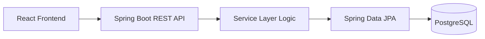

# AgileTrack

AgileTrack is a full-stack project and release management application. It provides structured workflows for managing workspaces, projects, tasks, dependency relationships, and releases. The application is designed to solve complex engineering project coordination problems by offering strong data consistency, isolated multi-tenant workspaces, and derived release readiness evaluations.

## Features

- **Workspace, Project, Task, Dependency, and Release Management:** End-to-end management of the software delivery lifecycle.
- **Workspace-Scoped Authorization:** The backend strictly isolates access by workspace. The `WorkspaceService` verifies user membership and role before permitting mutations, preventing cross-workspace data access and blocking read-only `VIEWER` users from modifying resources.
- **Task Dependency-Cycle Detection:** Dependency addition is guarded by a bounded breadth-first search (BFS) graph traversal (using a queue and visited set) in `DependencyCycleDetector.java` to prevent circular task dependency relationships.
- **Release-Readiness Evaluation:** Release readiness is dynamically evaluated via the `ReadinessService`, aggregating task statuses and blockages. **The backend strictly enforces this rule**, rejecting transitions to `RELEASED` if the readiness verdict is not `READY`.
- **JPA Optimistic Locking and HTTP 409 Conflict Handling:** Concurrent modifications are detected using JPA `@Version` annotations on entities. Stale updates throw an `ObjectOptimisticLockingFailureException`, which the `GlobalExceptionHandler` translates seamlessly into an HTTP 409 Conflict for the frontend to handle.
- **Database Migration and Persistence Management:** A rigorous, versioned approach to schema evolution using Flyway.
- **Frontend Workflows and Validation:** A React frontend delivering real-time validation and localized error feedback.

## Architecture

The system follows a standard modern web application architecture:


```mermaid
flowchart LR
    UI[React Frontend] --> API[Spring Boot REST API]
    API --> Service[Service Layer Logic]
    Service --> JPA[Spring Data JPA]
    JPA --> DB[(PostgreSQL)]
```

- **React Frontend:** Built with Vite and TypeScript, providing a responsive UI.
- **Spring Boot REST API:** Handles HTTP routing, request validation, and API serialization.
- **Service Layer Logic:** Enforces business rules (e.g., dependency cycles, workspace authorization, readiness enforcement).
- **Spring Data JPA & PostgreSQL:** Manages relational persistence, transaction boundaries, and optimistic locking.

## Technical Design Highlights

- **Graph Traversal for Dependency-Cycle Detection:** Instead of relying on a simple depth limit or database-level triggers, the backend implements an in-memory BFS with a visited set to accurately detect cycles when defining task dependencies, preventing infinite loops.
- **Backend Release-Readiness Rules:** A stateless, dynamically evaluated rule engine aggregates task status and blockages to compute a single readiness verdict without persisting redundant state.
- **Workspace Authorization Boundaries:** Implemented at the service layer rather than in controllers, ensuring business logic securely resolves user permissions before execution, even for internal service-to-service calls.
- **Optimistic Locking for Concurrent Updates:** Row-level version tracking guarantees that concurrent UI updates do not overwrite one another, maintaining data integrity in collaborative workspaces.
- **Relational Persistence and Schema Evolution through Flyway:** The database schema is carefully versioned and evolved deterministically via SQL migrations rather than Hibernate auto-DDL.
- **Backend/Frontend Integration and Error Handling:** The global exception handler consistently translates backend domain and concurrency exceptions to appropriate HTTP status codes (e.g., 409 Conflict, 403 Forbidden).

## Database Schema and Migrations

The PostgreSQL database schema is exclusively managed by Flyway via SQL scripts located in `backend/src/main/resources/db/migration/`.

- **Migrations:** 20 sequential SQL migration files.
- **Tables:** 7 database tables created after applying the full migration lifecycle (`users`, `workspaces`, `workspace_members`, `projects`, `tasks`, `releases`, `work_item_dependencies`).
- **Relationships:** Foreign key constraints firmly establish relational integrity (e.g., tasks belong to projects, tasks belong to releases, work item dependencies reference tasks).
- **Constraints:** Schema-level unique constraints (e.g., unique email per user) ensure data consistency independently of application logic.

## API Overview

The REST API exposes **38 method-level HTTP handler mappings** spread across **7 controller classes**. Class-level `@RequestMapping` annotations are used to scope endpoints logically by domain. 

Key domains include:
- **Workspaces & Members:** `POST /api/v1/workspaces`, `GET /api/v1/workspaces/{workspaceId}/members`
- **Projects:** `POST /api/v1/workspaces/{workspaceId}/projects`
- **Tasks:** `POST /api/v1/workspaces/{workspaceId}/projects/{projectId}/tasks`, `PATCH .../tasks/{taskId}/status`
- **Dependencies:** `POST /api/v1/workspaces/.../tasks/{taskId}/dependencies`
- **Releases & Readiness:** `PATCH /api/v1/workspaces/.../releases/{releaseId}/lifecycle`, `GET /api/v1/workspaces/.../releases/{releaseId}/readiness`
- **Auth:** `POST /api/v1/auth/login`

## Testing

The project maintains tests for both backend and frontend layers:
- **Backend integration tests** utilizing Testcontainers for real PostgreSQL interaction (ensuring Flyway migrations and dialect behavior are exercised).
- **Frontend component tests** utilizing Vitest and React Testing Library.

**219 total tests (154 backend, 65 frontend)** are verified to execute successfully via Docker environments equipped with Java 21+ and Node 24+.

## Prerequisites and Local Setup

**Required Dependencies:**
- Java 21+
- Node.js 24+ (Strictly enforced by `package.json` engines; Node 20 will fail on native `rolldown` bindings)
- npm
- Docker (Required for Testcontainers and local PostgreSQL)

**Running with Docker Compose (Recommended):**
```bash
docker-compose up --build
```
- Frontend: `http://localhost:3000`
- API: `http://localhost:3000/api/v1`

**Running Locally (Separate Processes):**

*Backend:*
```bash
cd backend
export DATABASE_URL=jdbc:postgresql://localhost:5432/agiletrack
export DATABASE_USERNAME=postgres
export DATABASE_PASSWORD=postgres
export JWT_SECRET=your_256_bit_secret_key
./mvnw spring-boot:run
```

*Frontend:*
```bash
cd frontend
export VITE_API_URL=http://localhost:8080/api/v1
npm install
npm run dev
```

*Running Tests:*
```bash
cd backend && ./mvnw test
cd frontend && npm run test:ci
```

## Repository Structure

```text
.
├── backend/
│   ├── src/main/java/com/agiletrack/backend/
│   │   ├── auth/            # Authentication
│   │   ├── common/          # Global exceptions and base entities
│   │   ├── dependency/      # BLOCKS graph and BFS cycle detection
│   │   ├── project/         # Project management
│   │   ├── readiness/       # Derived release readiness
│   │   ├── release/         # Delivery scope and lifecycle
│   │   ├── task/            # Work items
│   │   └── workspace/       # Tenancy and authorization
│   └── src/main/resources/db/migration/  # Flyway SQL migrations (V1-V20)
└── frontend/
    ├── src/
    │   ├── api/             # Axios configuration
    │   ├── components/      # Reusable React components
    │   ├── context/         # React Context (Auth)
    │   ├── hooks/           # Custom React hooks
    │   ├── pages/           # Application views
    │   ├── services/        # API service layers
    │   └── types/           # TypeScript interfaces
    └── tests/               # Frontend Vitest test suite
```

## Current Limitations

- **Frontend Test Environment:** The frontend tooling strictly requires Node 24+. Attempting to run `vitest` on older versions (like Node 20) results in native binary binding errors for `rolldown`.

## Future Improvements

- Refine frontend state caching to minimize redundant API requests.
